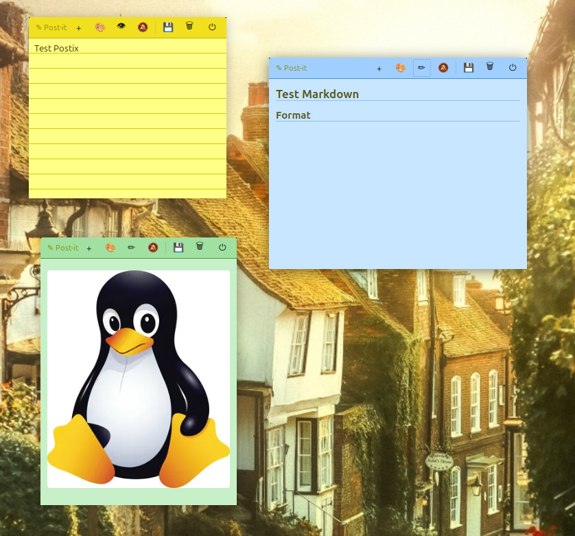

<div align="center">

# 📝 Postix

**Floating sticky notes for the Linux desktop**

Simple, lightweight, always on top — with alarms, colors, markdown and image support.

[](LICENSE)
[](https://github.com/arthur-alves/postix/releases)
[](https://python.org)
[](https://github.com/arthur-alves/postix/releases/latest)

---

### ⬇️ [Download .deb installer (Ubuntu / Debian)](https://github.com/arthur-alves/postix/releases/latest)

</div>

---

## 📸 Screenshot



> Multiple notes with different colors, markdown preview and image support — all floating over the desktop.

---

## ✨ Features

| Feature | Description |
|---|---|
| 🎨 **6 colors** | Yellow, Pink, Blue, Green, Orange, Lilac — real post-it style |
| 📌 **Always on top** | Floats over all other windows |
| 🖱️ **Drag & resize** | Move by the header, resize from any edge or corner |
| 📝 **Markdown** | Write in markdown and toggle a rendered preview (bold, lists, tables, code) |
| 🖼️ **Images** | Drag image files or paste with `Ctrl+V` directly into the note |
| 🔔 **Alarms** | Per note: one-time, daily or interval (e.g. every 2 h) |
| 🔊 **Custom sound** | Pick your own alarm sound (MP3, WAV, OGG · max 15 MB) |
| 💾 **Auto-save** | Saved automatically as you type |
| 🗄️ **100% local** | SQLite at `~/.local/share/postix/notes.db` — no cloud, no account |

---

## 📦 Installation

### Option 1 — Install the .deb (recommended)

**Step 1:** Download the `.deb` file from the [releases page](https://github.com/arthur-alves/postix/releases/latest)

**Step 2:** Install

**If your distro supports double-click install** (Ubuntu, Linux Mint, etc.):
> Double-click the `.deb` file → the package manager will open automatically

**Or via terminal:**
```bash
# Install
sudo dpkg -i postix_1.0.0_all.deb

# Fix any missing dependencies
sudo apt install -f
```

**Step 3:** Launch Postix
```bash
postix
# or search for "Postix" in your application menu
```

---

> **Linux Mint users:** if the app doesn't open after installing the `.deb`, run `sudo apt install -f` in the terminal to pull missing dependencies.

> **BigLinux / Arch / Manjaro / Fedora users:** `.deb` packages are not supported on your distro. Use **Option 2** below instead.

---

### Option 2 — Run from source (any Linux)

**Ubuntu / Debian / Linux Mint:**
```bash
sudo apt install python3-gi gir1.2-gtk-3.0 gir1.2-notify-0.7 \
                 libnotify-bin python3-markdown gir1.2-webkit2-4.1
```

**Arch / Manjaro / BigLinux:**
```bash
sudo pacman -S python-gobject gtk3 libnotify python-markdown webkit2gtk
```

**Fedora / RHEL:**
```bash
sudo dnf install python3-gobject gtk3 libnotify python3-markdown \
                 webkit2gtk4.1
```

Then clone and run:
```bash
git clone https://github.com/arthur-alves/postix.git
cd postix
python3 postix/main.py
```

---

### Option 3 — Install via Makefile

```bash
git clone https://github.com/arthur-alves/postix.git
cd postix

# Install dependencies
sudo apt install python3-gi gir1.2-gtk-3.0 gir1.2-notify-0.7 \
                 libnotify-bin python3-markdown

# Install system-wide
sudo make install

# To uninstall:
sudo make uninstall
```

---

## 🔨 Build the .deb on any Linux

> Works on any Debian/Ubuntu-based distro. No compiled language required — the `.deb` packages Python directly.

```bash
# 1. Clone
git clone https://github.com/arthur-alves/postix.git
cd postix

# 2. Make sure dpkg is available (already included on Debian/Ubuntu)
# If not:
sudo apt install dpkg

# 3. Build
python3 build_deb.py

# Output:
#   dist/postix_1.0.0_all.deb
```

**Install the generated package:**
```bash
sudo dpkg -i dist/postix_1.0.0_all.deb
```

---

## 📋 Dependencies

| Package | Required | Description |
|---|---|---|
| `python3` (≥ 3.6) | ✅ | Runtime |
| `python3-gi` | ✅ | GTK3 Python bindings |
| `gir1.2-gtk-3.0` | ✅ | GTK3 UI toolkit |
| `gir1.2-notify-0.7` | ✅ | Alarm notifications |
| `libnotify-bin` | ✅ | Notification daemon |
| `python3-markdown` | ✅ | Markdown rendering |
| `gir1.2-webkit2-4.1` | ⭐ Recommended | Markdown visual preview |
| `gir1.2-appindicator3-0.1` | ⭐ Recommended | System tray icon (Ubuntu) |
| `gstreamer1.0-plugins-good` | ⭐ Recommended | MP3 alarm audio |

---

## 🖥️ How to use

### Note controls

```
┌─────────────────────────────────────────────┐
│ ✎ Post-it  [+][🎨][👁][🔔] [💾][🗑][⏻]    │  ← header (drag here)
├─────────────────────────────────────────────┤
│                                             │
│  Write here... or use **markdown**          │
│                                             │
│  - Lists                                    │
│  - **Bold**, _italic_                       │
│                                             │
└─────────────────────────────────────────────┘
                                     ↖ drag corners to resize
```

| Button | Action |
|---|---|
| `+` | New note |
| `🎨` | Change color (6 options) |
| `👁` / `✏` | Toggle edit / markdown preview |
| `🔔` / `🔕` | Configure alarm |
| `💾` | Save manually |
| `🗑` | Delete note (asks for confirmation) |
| `⏻` | Quit application |

### Supported markdown

```markdown
# Heading
**bold** and _italic_

- List item
- Another item

| Column 1 | Column 2 |
|----------|----------|
| data     | data     |

`inline code`

```code block```
```

### Images in notes

- **Drag & drop:** drag a `.png`, `.jpg`, `.gif`, `.webp` etc. file into the note
- **Paste:** copy any image and use `Ctrl+V` inside the note

Images are rendered in preview mode (`👁`).

### Alarms

Click `🔕` to configure:

- **Once** → specific date and time
- **Daily** → fires every day at the set time (e.g. `14:00`)
- **Interval** → every N hours/minutes (e.g. every `2h 30min`)

Each alarm can have its own sound (MP3, WAV or OGG, max 15 MB). Use `▶` to preview before saving.

---

## 📁 Data location

```
~/.local/share/postix/
├── notes.db          ← SQLite database (notes + alarms)
└── images/
    └── {id}/         ← images per note
```

---

## 🐛 Troubleshooting

**Tray icon not showing**
> Install: `sudo apt install gir1.2-appindicator3-0.1`

**Markdown preview not available**
> Install: `sudo apt install gir1.2-webkit2-4.1`

**Alarm sound not playing**
> Install: `sudo apt install gstreamer1.0-plugins-good gstreamer1.0-plugins-ugly`

**How do I back up my notes?**
> Copy `~/.local/share/postix/notes.db`

---

## 🤝 Contributing

Pull requests are welcome!

```bash
git clone https://github.com/arthur-alves/postix.git
cd postix
python3 postix/main.py   # run locally
```

---

## 📄 License

[MIT](LICENSE) © 2026 Arthur Alves &lt;arthur.4lvevs@gmail.com&gt;
